# Spanish Grammar Dependency Graph

This document visualizes the prerequisite relationships between Spanish grammar topics for CEFR levels A1-B1, showing the natural progression and dependencies for optimal learning.

---

## Overview

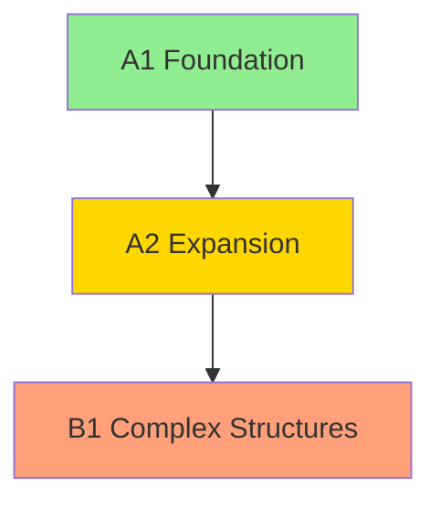

**Learning Path Summary**:
- **A1**: Present tense mastery, basic noun/adjective agreement, fundamental pronouns
- **A2**: Past tenses (preterite/imperfect), object pronouns, commands
- **B1**: Subjunctive mood, future/conditional, complex subordination

---

## A1 Level: Foundation (Entry Points)

### Parallel Entry Points (No Prerequisites)

These topics can be learned simultaneously as they don't depend on each other:

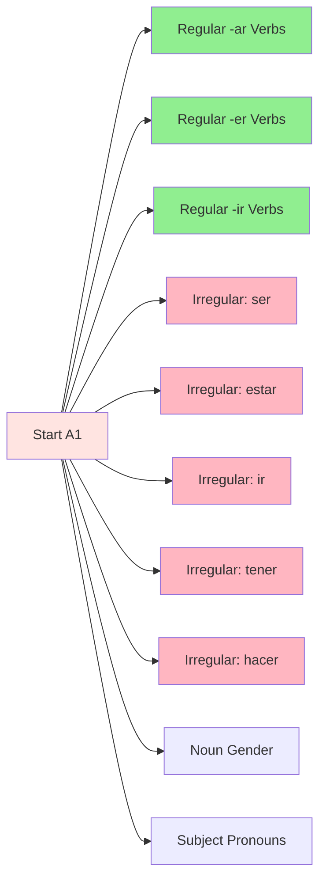

**Legend**:
- Green: Regular patterns (easier)
- Pink: Irregular verbs (harder but high-frequency)

---

## A1 Verbal System Dependencies

### Present Tense Progression

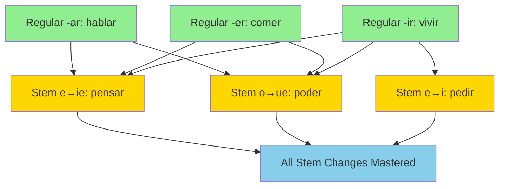

**Rationale**: Stem-changing verbs require understanding of regular conjugation patterns first. Learners must recognize the base pattern before understanding stem changes.

### Progressive and Periphrastic Constructions

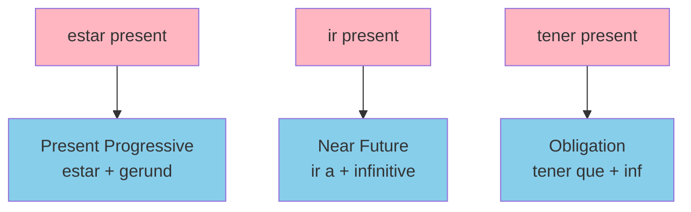

**Rationale**: Periphrastic constructions depend on mastering the auxiliary verb first.

---

## A1 Nominal System Dependencies

### Noun-Adjective-Article Agreement Chain

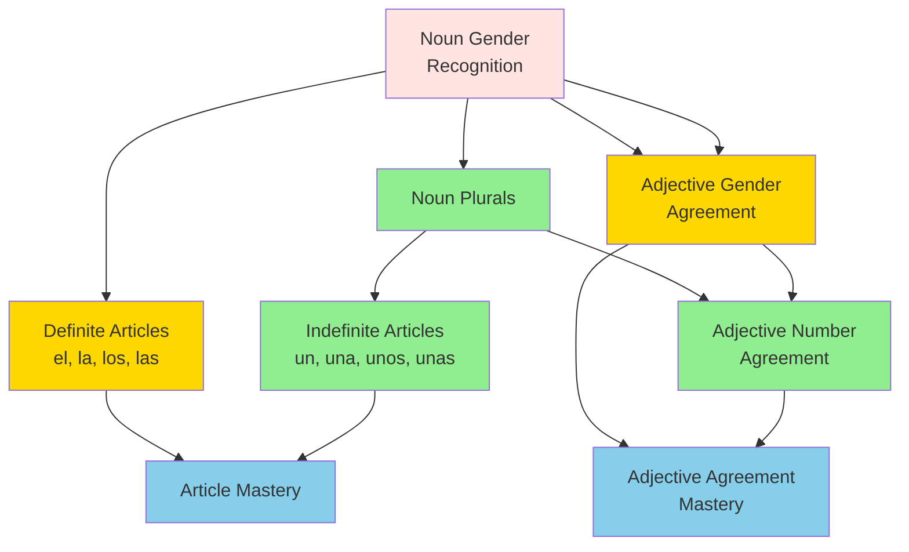

**Rationale**:
- Gender must be learned before number (singular forms establish gender patterns)
- Articles and adjectives both depend on recognizing noun gender
- Number agreement builds on gender agreement

**Research Note**: Definite articles are acquired late despite early introduction (Natural Order Hypothesis)

---

## A1 Pronominal System Dependencies

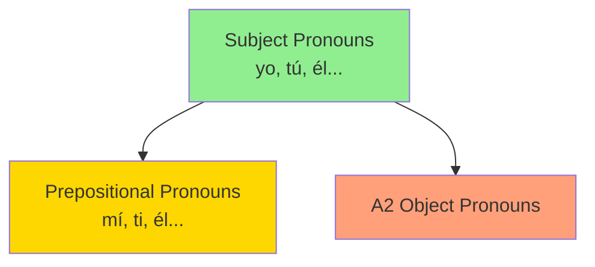

**Rationale**: Subject pronouns are foundational for all other pronoun systems.

---

## A1 Idiomatic Constructions

### Ser vs Estar

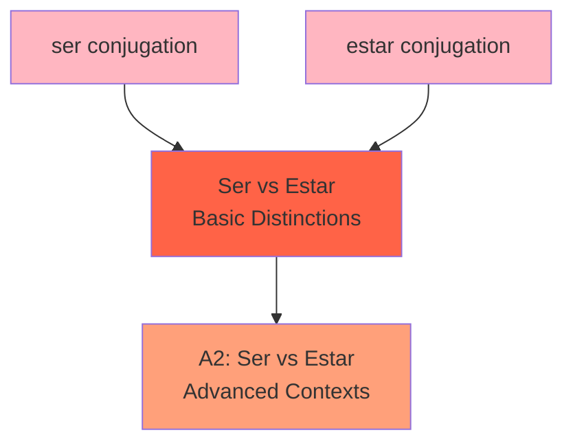

**Difficulty Note**: Ser vs estar is conceptually difficult for English speakers. Requires extensive contextualized practice across both A1 and A2 levels.

---

## A1 → A2 Transition Requirements

### Gating Topics (Must Master to Progress)

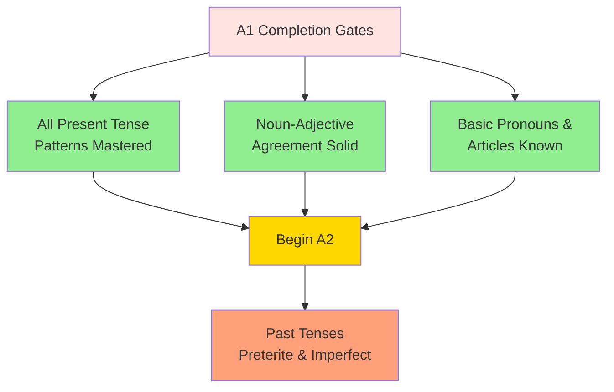

**Rationale**: Present tense forms the conceptual and morphological foundation for all other tenses. Cannot understand past tense without present tense mastery.

---

## A2 Level: Expansion

### Past Tense Dependencies

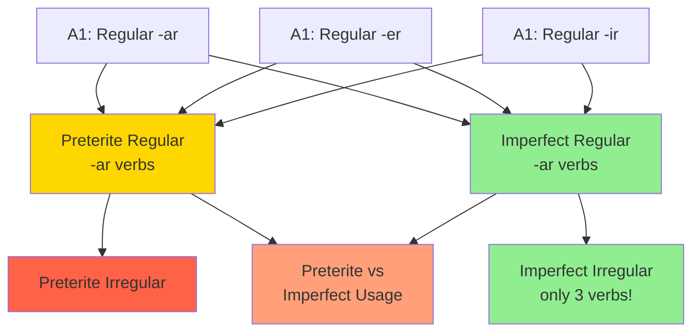

**Teaching Note**:
- Some educators prefer teaching imperfect before preterite (easier conjugation)
- Instituto Cervantes and most textbooks teach preterite first
- Both approaches valid; our system supports either order

### Compound Past Tenses

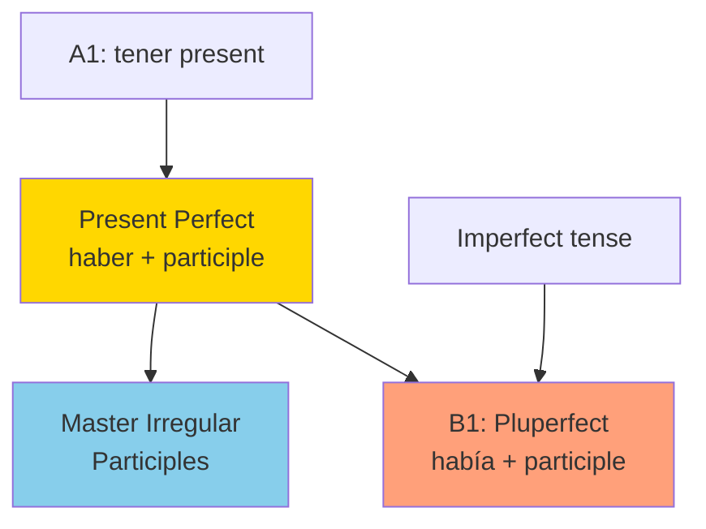

**Morphological Note**: Present perfect introduces past participle formation, which is reused in all perfect tenses.

---

## A2 Object Pronouns System

### Sequential Introduction

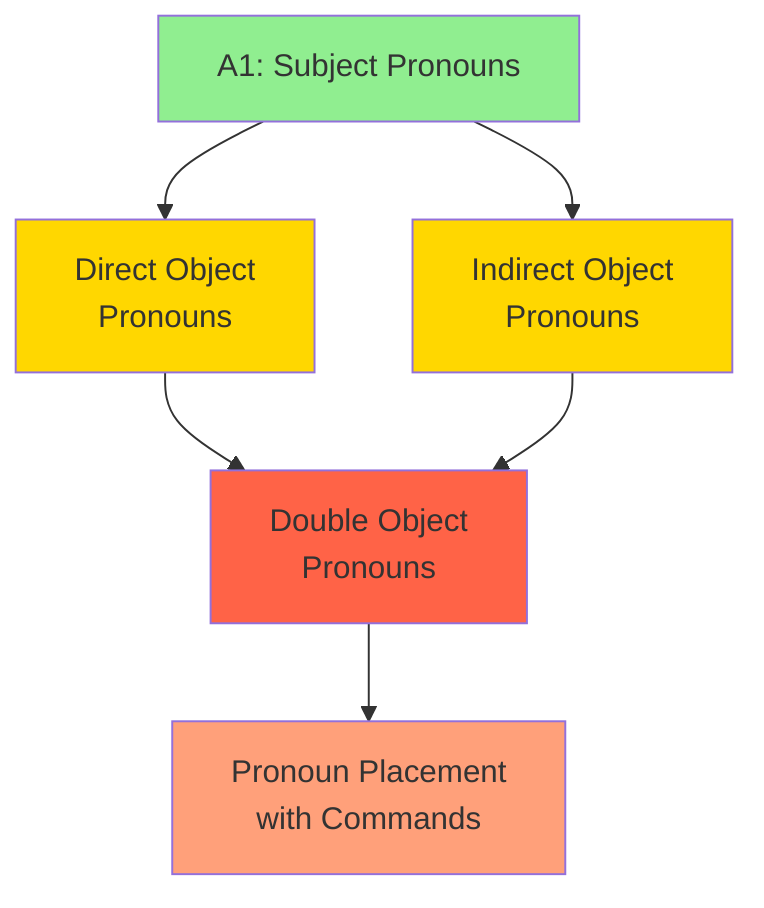

**Difficulty Progression**:
- Direct object pronouns (medium difficulty)
- Indirect object pronouns (medium difficulty)
- Double pronouns (hard - requires both systems + le→se transformation)

---

## A2 Commands (Imperative)

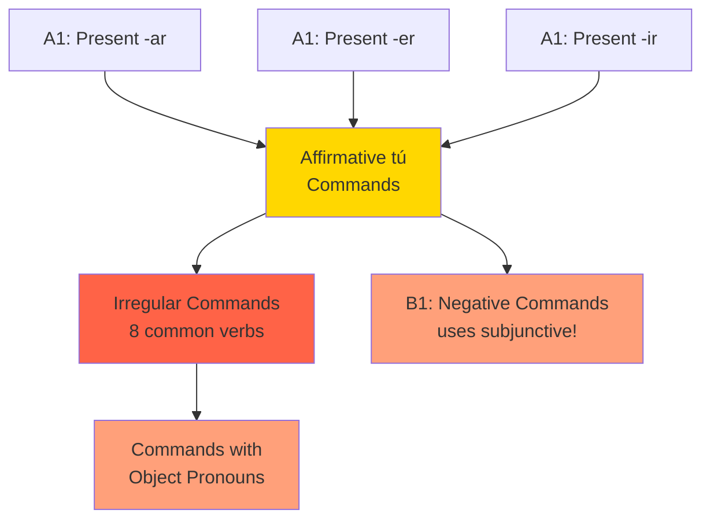

**Critical Connection**: Negative commands require subjunctive mood (B1 topic), creating a dependency bridge from A2 to B1.

---

## A2 Comparison System

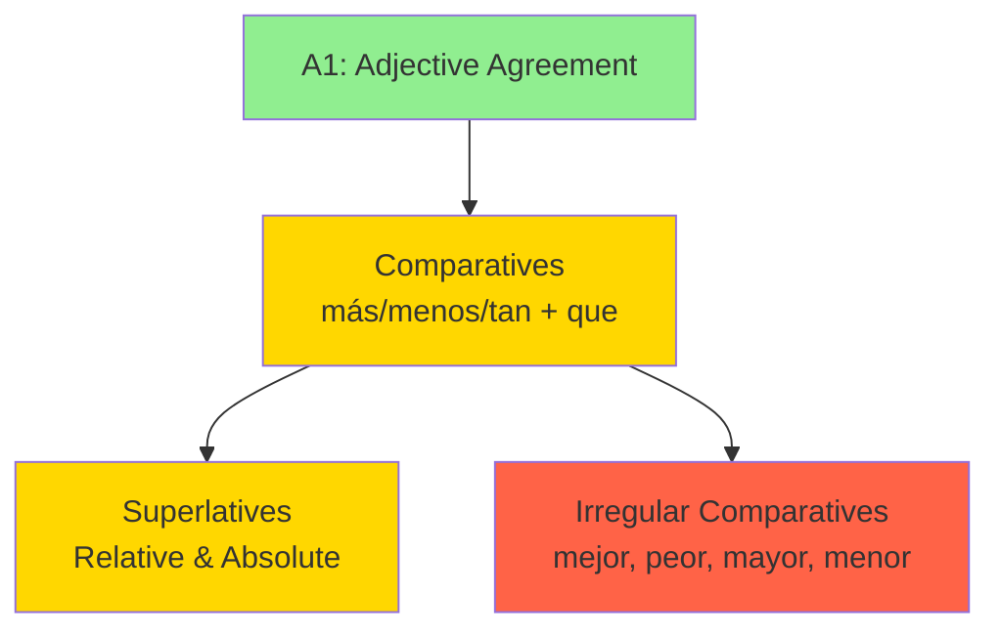

---

## A2 → B1 Transition Requirements

### Gating Topics (Must Master to Progress)

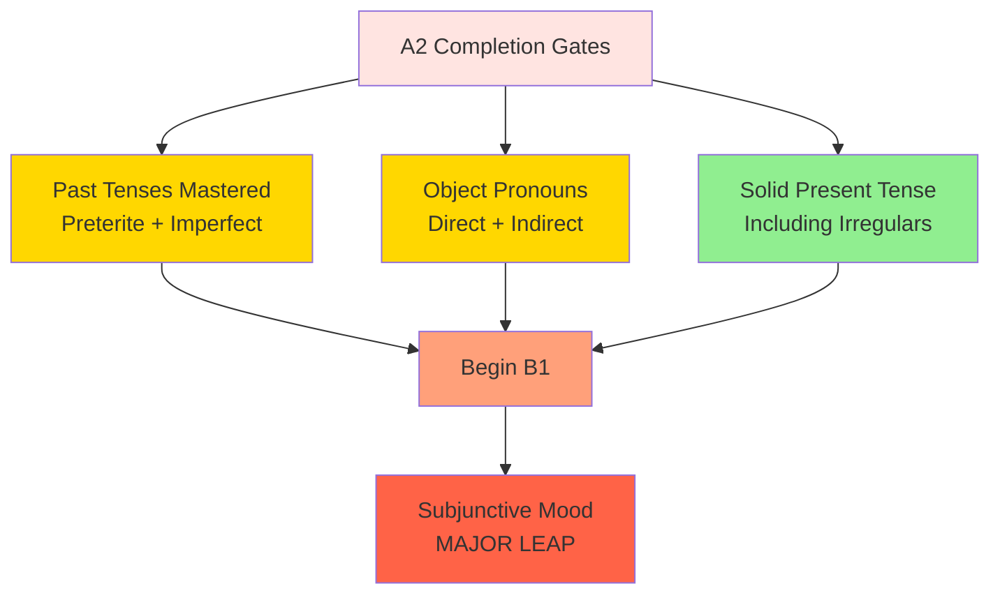

**Critical Requirement**: Present tense mastery is essential for subjunctive formation (uses yo-form stem).

---

## B1 Level: Complex Structures

### Subjunctive System (The B1 Bottleneck)

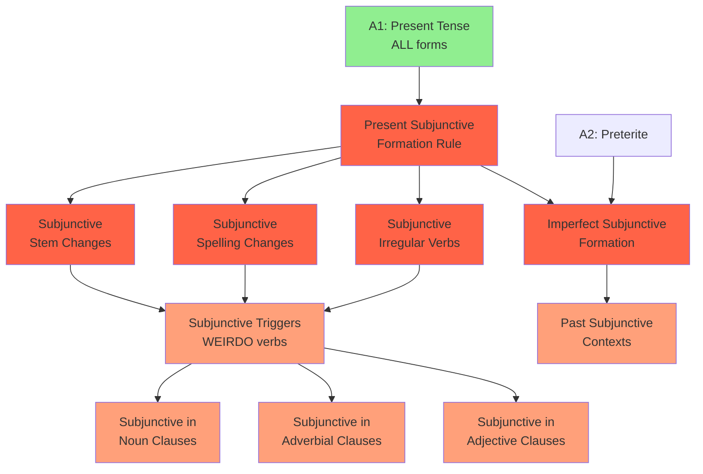

**Subjunctive Formation Dependencies**:
1. **Present subjunctive**: Requires mastery of yo-form in present indicative
2. **Imperfect subjunctive**: Requires 3rd plural preterite stem
3. **Conceptual prerequisite**: Understanding indicative vs subjunctive mood distinction
4. **Syntactic prerequisite**: Complex syntax knowledge (subordination)

**Research Finding**: "Some syntactic knowledge is a prerequisite for the processing, and so development of, verbal morphology" (subjunctive acquisition studies)

### Subjunctive Granularity (Kwiziq Approach)

Rather than teaching "subjunctive" as monolithic topic, break into contexts:

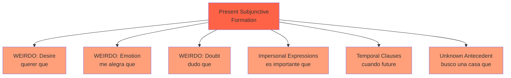

**Pedagogical Benefit**: Learners master one trigger context at a time, reducing cognitive load.

---

## B1 Future and Conditional

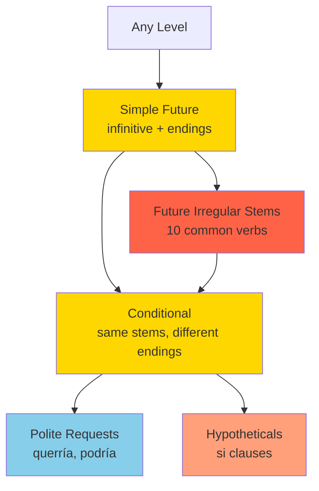

**Note**: Future and conditional don't require other tense prerequisites (formed from infinitive). Can be taught earlier than B1 in some approaches.

**Shared Irregularity**: Future and conditional use identical irregular stems (pondr-, tendr-, etc.), making them efficient to teach together.

---

## B1 Perfect Tenses

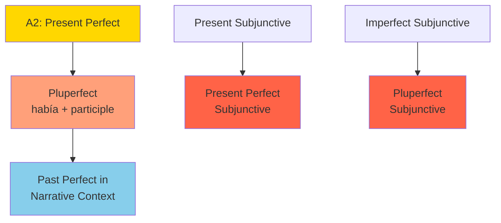

**Efficiency**: Once participle formation is mastered (A2), all perfect tenses follow same pattern with different auxiliary conjugations.

---

## B1 Commands (All Forms)

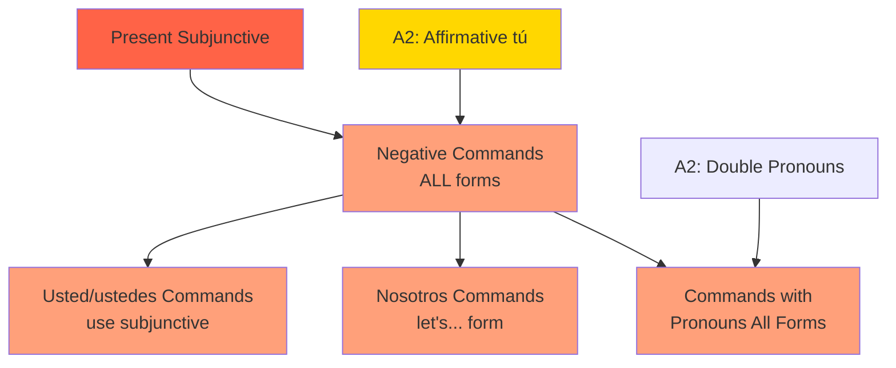

**Critical Connection**: Subjunctive mastery unlocks negative commands and formal commands (usted/ustedes forms).

---

## B1 Complex Syntax Dependencies

### Subordination System

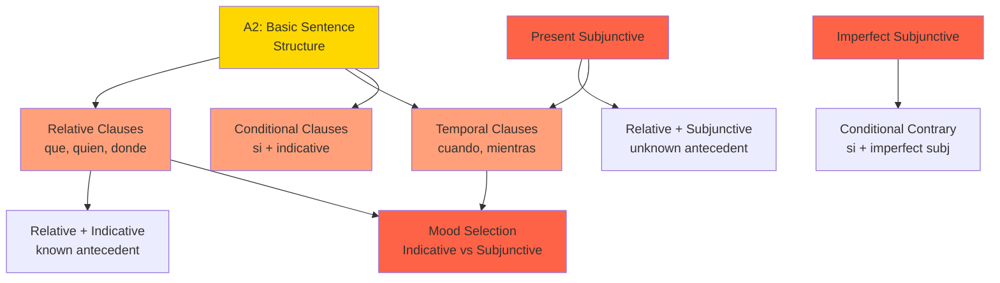

**Mood Selection Rule**:
- **Indicative**: Known, factual, habitual
- **Subjunctive**: Unknown, future, hypothetical, subjective

---

## B1 Passive Voice

```mermaid
graph TD
    BASIC[A2: Sentence Structure] --> SYN030[Passive se<br/>se vende]

    SYN030 --> AGREEMENT[Se Agreement<br/>with Subject]

    V063[Pluperfect] --> SYN031[Passive ser + participle<br/>fue vendido]

    style BASIC fill:#FFD700
    style SYN030 fill:#FFA07A
    style AGREEMENT fill:#87CEEB
    style SYN031 fill:#FFA07A
```

---

## Complete Dependency Map: A1 → A2 → B1

### High-Level Progression

```mermaid
graph TD
    START[Begin Spanish] --> A1_PRESENT[A1: Present Tense<br/>Regular + Irregular]
    START --> A1_NOUNS[A1: Noun-Adjective<br/>Agreement]

    A1_PRESENT --> A1_PROG[A1: Progressive<br/>& Periphrastic]
    A1_NOUNS --> A1_ARTICLES[A1: Articles &<br/>Basic Pronouns]

    A1_PRESENT --> A2_PAST[A2: Past Tenses<br/>Preterite & Imperfect]
    A1_PRESENT --> A2_PERFECT[A2: Present Perfect]

    A1_ARTICLES --> A2_OBJECT[A2: Object Pronouns<br/>Direct & Indirect]

    A2_PAST --> A2_USAGE[A2: Preterite vs<br/>Imperfect Usage]

    A1_PRESENT --> A2_COMMANDS[A2: Commands<br/>Affirmative tú]

    A2_PAST --> B1_PLUPERFECT[B1: Pluperfect]
    A2_PERFECT --> B1_PLUPERFECT

    A1_PRESENT --> B1_SUBJUNCTIVE[B1: Subjunctive<br/>BOTTLENECK]
    A2_PAST --> B1_SUBJUNCTIVE

    B1_SUBJUNCTIVE --> B1_COMPLEX[B1: Complex Syntax<br/>Subordination]
    B1_SUBJUNCTIVE --> B1_COMMANDS_NEG[B1: Negative Commands]

    A1_PRESENT --> B1_FUTURE[B1: Future &<br/>Conditional]

    style START fill:#FFE4E1
    style A1_PRESENT fill:#90EE90
    style A1_NOUNS fill:#90EE90
    style A2_PAST fill:#FFD700
    style A2_OBJECT fill:#FFD700
    style B1_SUBJUNCTIVE fill:#FF6347
    style B1_COMPLEX fill:#FFA07A
```

---

## Bottleneck Topics (High Dependency)

These topics unlock many subsequent topics:

### 1. Present Tense (All Forms) - A1
**Unlocks**:
- All stem-changing verbs (A1)
- Progressive tenses (A1)
- Present subjunctive (B1) ← Major unlock
- Near future (A1)

### 2. Preterite Tense - A2
**Unlocks**:
- Preterite vs imperfect usage (A2)
- Imperfect subjunctive formation (B1)
- Narrative skills (B1)

### 3. Present Subjunctive - B1
**Unlocks**:
- All subordinate clauses with subjunctive (B1)
- Negative commands (B1)
- Formal commands (B1)
- Impersonal expressions (B1)
- Advanced temporal clauses (B1)

### 4. Noun Gender - A1
**Unlocks**:
- Noun plurals (A1)
- Definite articles (A1)
- Indefinite articles (A1)
- Adjective gender agreement (A1)
- Adjective number agreement (A1)

### 5. Subject Pronouns - A1
**Unlocks**:
- Prepositional pronouns (A1)
- Direct object pronouns (A2)
- Indirect object pronouns (A2)
- Double object pronouns (A2)

---

## Learning Path Recommendations

### Sequential Path (Traditional)

```
A1.1: Regular present tense (-ar, -er, -ir) + high-frequency irregulars (ser, estar, ir, tener, hacer)
      Noun gender + plurals + definite articles
      Subject pronouns

A1.2: Stem-changing verbs (e→ie, o→ue, e→i)
      Present progressive (estar + gerund)
      Near future (ir a + infinitive)
      Adjective agreement
      Ser vs estar (basic contexts)

A2.1: Preterite regular and irregular
      Imperfect regular and irregular
      Direct object pronouns
      Indirect object pronouns
      Comparatives

A2.2: Present perfect
      Preterite vs imperfect usage
      Double object pronouns
      Affirmative tú commands
      Superlatives

B1.1: Present subjunctive (formation + common triggers)
      Simple future
      Conditional
      Relative clauses
      Real conditional clauses (si + indicative)

B1.2: Imperfect subjunctive
      Subjunctive in all contexts (noun, adjective, adverbial clauses)
      Pluperfect
      Negative commands
      Passive voice
      Complex subordination
```

### Parallel Path (Modern Approach)

Allow multiple grammar topics to be studied simultaneously when they don't depend on each other:

**Tracks that can run in parallel**:
- **Verbal track**: Present → Past → Future → Subjunctive
- **Nominal track**: Nouns → Articles → Adjectives
- **Pronominal track**: Subject → Object → Reflexive
- **Syntactic track**: Simple sentences → Coordination → Subordination

### Communicative Path (Task-Based)

Introduce grammar as needed for communicative tasks:
- **Introducing yourself**: ser present + subject pronouns + noun gender
- **Describing location**: estar present + prepositions + demonstratives
- **Talking about habits**: present tense + frequency adverbs
- **Narrating past events**: preterite + imperfect + temporal markers
- **Expressing desires**: present subjunctive + querer que
- **Making plans**: future tense / ir a + infinitive

---

## Implementation Notes for HablaConmigo

### Database Representation

```sql
-- Store dependencies
CREATE TABLE grammar_dependencies (
    topic_id TEXT NOT NULL,
    prerequisite_id TEXT NOT NULL,
    dependency_type TEXT CHECK(dependency_type IN ('required', 'recommended', 'related')),
    PRIMARY KEY (topic_id, prerequisite_id)
);

-- Example entries:
INSERT INTO grammar_dependencies VALUES
    ('A1_V_004', 'A1_V_001', 'required'),  -- Stem changes require regular -ar
    ('A1_V_004', 'A1_V_002', 'required'),  -- Stem changes require regular -er
    ('B1_V_050', 'A1_V_001', 'required'),  -- Subjunctive requires present tense
    ('B1_V_080', 'B1_V_050', 'required'),  -- Negative commands require subjunctive
    ('A2_V_027', 'A2_V_020', 'recommended'), -- Usage requires both tenses
    ('A2_V_027', 'A2_V_024', 'recommended');
```

### Unlock Algorithm

```python
def get_unlockable_topics(user_id):
    """Return topics where all required prerequisites are mastered."""
    mastered = get_mastered_grammar(user_id)
    all_topics = get_all_topics_for_target_level(user_id)

    unlockable = []
    for topic in all_topics:
        if topic in mastered:
            continue  # Already mastered

        prereqs = get_prerequisites(topic, type='required')

        if all(prereq in mastered for prereq in prereqs):
            unlockable.append(topic)

    return unlockable


def get_next_recommended_topic(user_id):
    """Suggest best next topic considering multiple factors."""
    unlockable = get_unlockable_topics(user_id)

    # Score each unlockable topic
    scored = []
    for topic in unlockable:
        score = 0

        # Factor 1: Natural acquisition order (from research)
        score += get_acquisition_order_score(topic)

        # Factor 2: Frequency in content (how often it appears)
        score += get_frequency_score(topic)

        # Factor 3: Unlocking power (how many topics depend on this)
        enables = get_enabled_topics(topic)
        score += len(enables) * 10

        # Factor 4: Difficulty (prefer easier when equal utility)
        difficulty = get_difficulty(topic)
        score -= {'easy': 0, 'medium': 5, 'hard': 10}[difficulty]

        scored.append((topic, score))

    # Return highest scoring
    scored.sort(key=lambda x: x[1], reverse=True)
    return scored[0][0] if scored else None
```

### User Interface: Dependency Visualization

Show dependency graph like Kwiziq brain map:
- **Locked topics** (gray): Prerequisites not met
- **Unlocked topics** (yellow): Ready to learn
- **Learning topics** (orange): Currently practicing
- **Mastered topics** (green): Achieved proficiency

---

## Summary

This dependency graph provides:

1. **Clear prerequisites**: Know exactly what to learn before each topic
2. **Multiple valid paths**: Sequential, parallel, or communicative approaches
3. **Bottleneck identification**: Focus on high-leverage topics (present tense, subjunctive)
4. **Research-validated**: Based on Natural Order Hypothesis and Processability Theory
5. **Implementation-ready**: SQL schema and algorithms provided

**Key Insight**: The subjunctive mood at B1 is the major conceptual leap in Spanish grammar, requiring both formational prerequisites (present tense mastery) and conceptual prerequisites (understanding mood distinctions and complex syntax).

---

**Next Steps**:
1. Implement dependency tracking in database
2. Build unlock algorithm
3. Create visual dependency browser in UI
4. Validate with pilot users
5. Adjust based on learner outcomes
